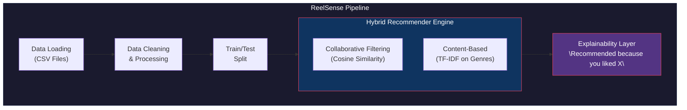

<p align="center">
  
  
  
  
</p>

<h1 align="center">ReelSense</h1>

<p align="center">
  <strong>An Intelligent Hybrid Movie Recommendation System</strong>
  <br>
  <em>Combining Collaborative Filtering + Content-Based Features with Explainability</em>
</p>

<p align="center">
  <a href="#features">Features</a> •
  <a href="#tech-stack">Tech Stack</a> •
  <a href="#quick-start">Quick Start</a> •
  <a href="#how-it-works">How It Works</a> •
  <a href="#evaluation-metrics">Metrics</a> •
  <a href="#project-structure">Structure</a>
</p>

---

## Features

| Feature | Description |
|---------|-------------|
| **Hybrid Recommendations** | Combines collaborative filtering with content-based methods for superior accuracy |
| **Smart Explainability** | Every recommendation comes with a human-readable explanation |
| **Comprehensive Evaluation** | Includes Precision@K, Recall@K, diversity, and coverage metrics |
| **Popularity-Based Fallback** | Cold-start handling with weighted popularity scoring |
| **Long-Tail Analysis** | Visualizes and addresses item popularity distribution |
| **Leave-Last-N Split** | Proper temporal train-test splitting for recommender systems |

---

## Tech Stack

<table>
<tr>
<td align="center" width="96">

<br>Python
</td>
<td align="center" width="96">

<br>Pandas
</td>
<td align="center" width="96">

<br>NumPy
</td>
<td align="center" width="96">

<br>Scikit-learn
</td>
<td align="center" width="96">

<br>Jupyter
</td>
</tr>
</table>

---

## Quick Start

### Prerequisites
- Python 3.8+
- pip / pip3
- Git

### Installation

#### Step 1: Clone the Repository

```bash
git clone https://github.com/sciguy-code/reelsense.git
cd reelsense
```

---

#### Step 2: Create Virtual Environment

<details>
<summary><b>macOS</b></summary>

```bash
python3 -m venv venv
source venv/bin/activate
```

</details>

<details>
<summary><b>Linux (Ubuntu/Debian)</b></summary>

```bash
# Install venv if not available
sudo apt install python3-venv

# Create and activate
python3 -m venv venv
source venv/bin/activate
```

</details>

<details>
<summary><b>Windows (PowerShell)</b></summary>

```powershell
python -m venv venv
.\venv\Scripts\Activate.ps1
```

> **Note:** If you get an execution policy error, run:
> ```powershell
> Set-ExecutionPolicy -ExecutionPolicy RemoteSigned -Scope CurrentUser
> ```

</details>

<details>
<summary><b>Windows (Command Prompt)</b></summary>

```cmd
python -m venv venv
venv\Scripts\activate.bat
```

</details>

---

#### Step 3: Install Dependencies

```bash
pip install -r requirements.txt
```

---

#### Step 4: Launch Jupyter Notebook

```bash
jupyter notebook reel_sense.ipynb
```

> **Tip**: If `jupyter` is not found, install it with:
> ```bash
> pip install jupyter
> ```

---

## How It Works

### Architecture Overview



### Algorithm Details

#### Step 1: Data Preprocessing
- **Timestamp Conversion**: Unix timestamps to datetime objects
- **Year Extraction**: Regex-based extraction from movie titles
- **Genre Parsing**: Pipe-separated genres to lists
- **Noise Filtering**: 
  - Movies with < 5 ratings removed
  - Users with < 20 ratings removed

#### Step 2: Collaborative Filtering
Uses **Item-Item Similarity** computed via cosine similarity:

```python

similarity = item_vectors @ item_vectors.T
cf_scores = user_ratings @ similarity
```

#### Step 3: Content-Based Filtering
Leverages **TF-IDF Vectorization** on genre metadata:

```python
tfidf_matrix = TfidfVectorizer().fit_transform(genres)
genre_sim = cosine_similarity(tfidf_matrix)
```

#### Step 4: Hybrid Score Blending
```python
final_score = α × CF_score + (1 - α) × Content_score
```
Where `α = 0.7` (adjustable weight parameter)

---

## Evaluation Metrics

### Model Performance

| K Value | Precision@K | Recall@K |
|---------|-------------|----------|
| K=5     | 0.63%       | 3.16%    |
| K=10    | 0.50%       | 4.98%    |
| K=20    | 0.47%       | 9.30%    |

### Diversity & Coverage

| Metric | Value |
|--------|-------|
| **Catalog Coverage** | 6.20% |
| **Unique Items Recommended** | 604 |

### Comparison: Hybrid vs Popularity-Based

```
Hybrid Model (K=10):      Precision: 0.50%  |  Recall: 4.98%
Popularity-Based (K=10):  Precision: 0.25%  |  Recall: 2.49%

Hybrid Model Improvement: ~2x better performance
```

---

## Project Structure

```
reelsense/
├── reel_sense.ipynb      # Main Jupyter notebook with full implementation
├── requirements.txt      # Python dependencies
├── README.md             # Project documentation
├── ml-latest-small/      # MovieLens dataset
│   ├── movies.csv        # Movie metadata (9,742 movies)
│   ├── ratings.csv       # User ratings (100,836 ratings)
│   ├── tags.csv          # User-generated tags
│   └── links.csv         # External database links
└── venv/                 # Virtual environment (not tracked)
```

---

## Dataset

This project uses the **MovieLens ml-latest-small** dataset:

| Statistic | Value |
|-----------|-------|
| **Total Ratings** | 100,836 |
| **Total Movies** | 9,742 |
| **Total Users** | 610 |
| **Rating Scale** | 0.5 - 5.0 |
| **Time Range** | 1996 - 2018 |

### Data Source
> F. Maxwell Harper and Joseph A. Konstan. 2015. *The MovieLens Datasets: History and Context*. ACM Transactions on Interactive Intelligent Systems (TiiS) 5, 4: 19:1–19:19.

---

## Sample Recommendations

### For User #1 (Action/Sci-Fi Enthusiast):

| Movie | Genres | Explanation |
|-------|--------|-------------|
| Fifth Element, The | Action\|Adventure\|Comedy\|Sci-Fi | You liked 'Star Wars: Episode VI', sharing Action, Sci-Fi, Adventure |
| Austin Powers | Action\|Adventure\|Comedy | You liked 'Austin Powers: International Man of Mystery', sharing Action, Comedy, Adventure |
| Die Hard | Action\|Crime\|Thriller | You liked 'Shaft', sharing Action, Thriller, Crime |
| Aliens | Action\|Adventure\|Horror\|Sci-Fi | You liked 'Star Wars: Episode VI', sharing Action, Sci-Fi, Adventure |
| Hunt for Red October | Action\|Adventure\|Thriller | You liked 'Dr. No', sharing Action, Thriller, Adventure |

---

## Future Improvements

- [ ] Matrix Factorization (SVD/ALS)
- [ ] Deep Learning approaches (Neural Collaborative Filtering)
- [ ] Web interface with Flask/FastAPI
- [ ] Real-time recommendation updates
- [ ] Mobile-responsive frontend

---

## Authors

Made with ❤️ for **BrainDead 2026 Hackathon**

---

## License

This project is licensed under the MIT License - see the [LICENSE](LICENSE) file for details.

---

<p align="center">
  <strong>Star this repo if you found it helpful!</strong>
</p>
